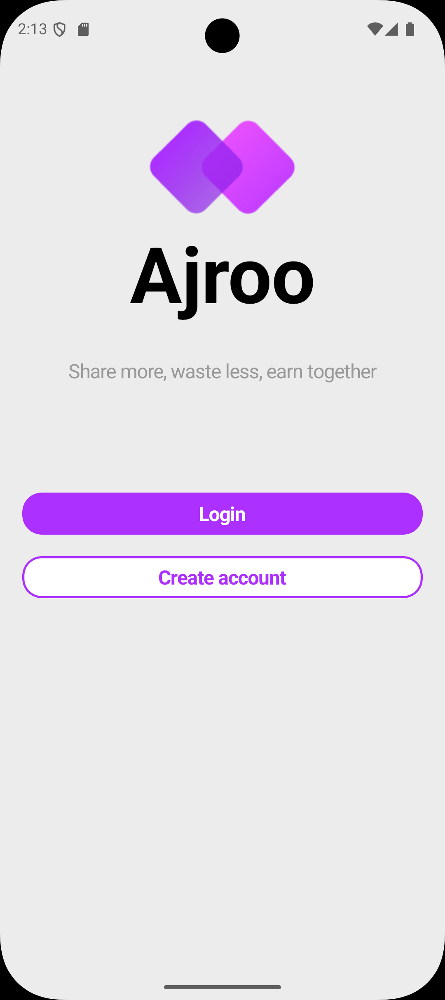
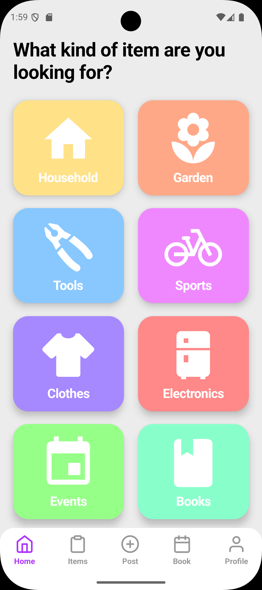
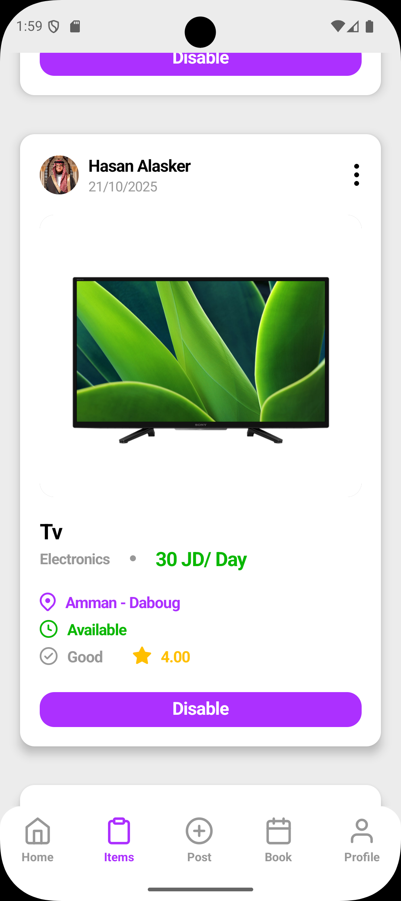
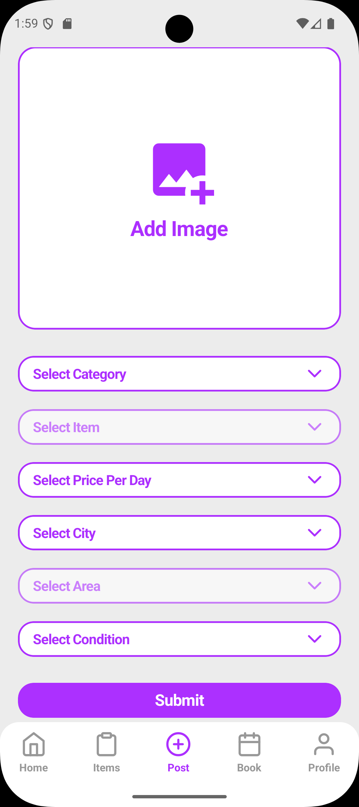
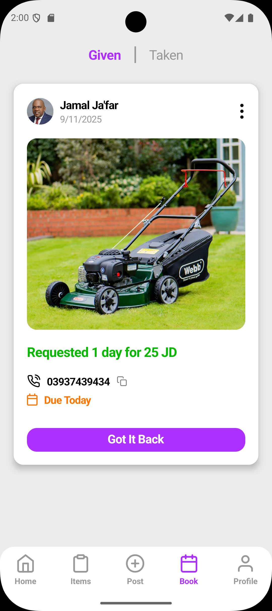
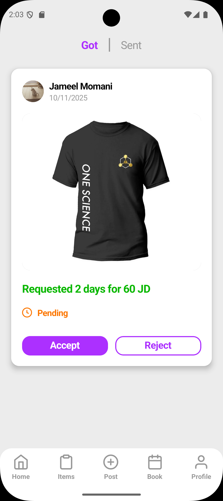
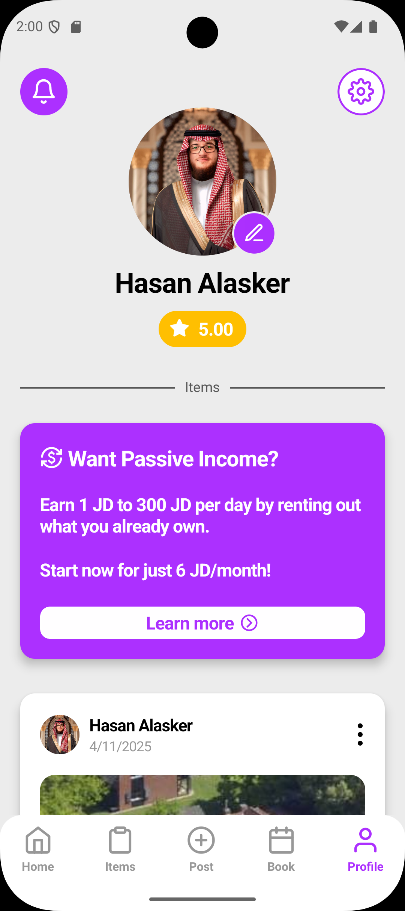
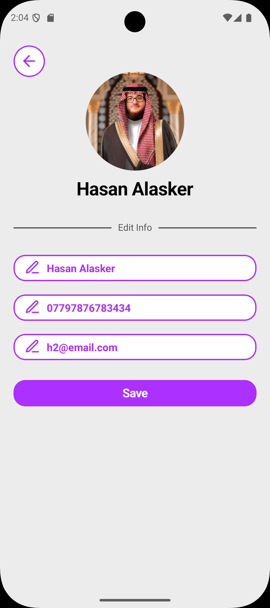
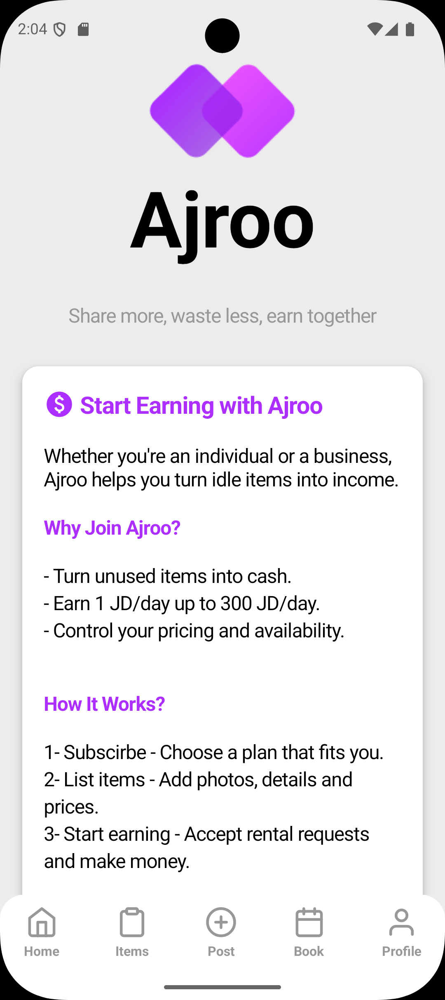
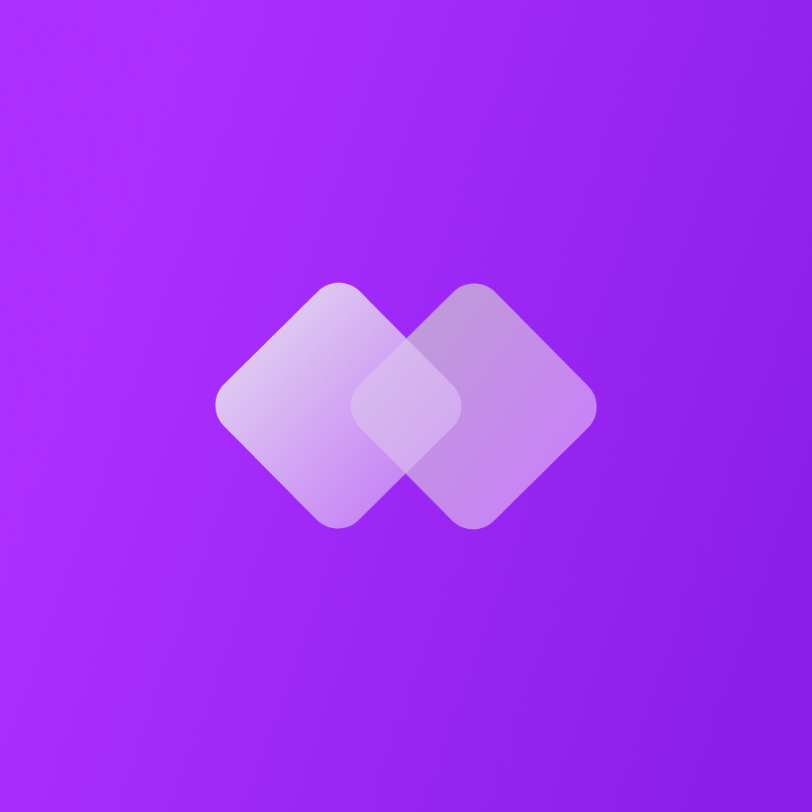

#  Ajroo

> **Share more, waste less, earn together.**  
> Empowering local communities through smarter sharing.

  
  
  

---

## 📱 What is Ajroo?

**Ajroo** is a mobile-first platform that allows everyday people to **lend and borrow household items** — from tools and sports equipment to books and electronics. It's designed to encourage **community trust**, **reduce waste**, and **save money** through item-sharing.

---

## 🎯 Use Cases

- Need a **projector** for one evening? Borrow it from a neighbor.
- Have a **power drill** sitting idle? Lend it and earn a review.
- Want to share **camping gear**, **books**, or **event supplies**? List them in seconds.

---

## ✨ Key Features

- 📦 **List Items for Lending**  
  Add photos, categories, and descriptions with ease.

- 🙋‍♂️ **Request to Borrow**  
  Borrowers can request items for a specific duration.

- 💬 **Notifications**  
  Get notified for requests, status updates, and reminders.

- 🌟 **Review System**  
  Rate and review users after each transaction.

- 🔐 **Authentication**  
  Secure user registration and login.

---

## 🛠 Tech Stack

| Layer        | Tech Used                |
|--------------|--------------------------|
| UI/UX        | Figma                    |
| Frontend     | React Native + Expo      |
| Backend/API  | Coming Soon              |
| Database     | Coming Soon              |
| Notifications| Expo Push Notifications  |
| Auth         | Planned (e.g., Firebase/Auth0/etc.) |

---

## 📸 Screenshots

---

## 🔒 Licensing & Usage

> **Ajroo is a private, closed-source project.**  
> Redistribution, reuse, or copying of code and design elements is **strictly prohibited**.  

---

## 👨‍💻 Author

**Hasan Alasker**  
Front-End Engineer | UI/UX Designer | Mobile Developer  
🌐 [Portfolio Website](https://hasan-alasker.netlify.app)  
📧 [hasanalasker.contact@gmail.com](mailto:hasanalasker.contact@gmail.com)

---

> *Building trust. Sharing smarter. Welcome to Ajroo.*
>
> 

